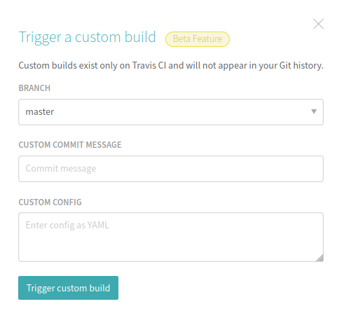

# travis-experiment

This repository just contains the bare minimal configuration file for Travis CI.

This allows to easily trigger custom builds using the Travis CI Web UI without
merge difficulties due to a complex base configuration.

